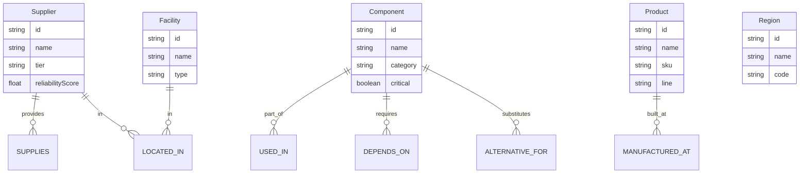

# SupplyTrace Chain Graph

A supply chain traceability web application built for the **Wexa AI CognoDB take-home assignment**. It models suppliers, components, products, facilities, and regions as a graph in **CognoDB Cloud**, then exposes risk analysis and impact tracing through a Next.js UI.

## Use case

Manufacturing and operations teams need to answer questions like:

- If a supplier goes offline, which products are affected?
- Which critical components have no backup vendor?
- Are multiple critical parts for one product concentrated in the same region?
- What substitute components and suppliers exist for a scarce part?

SupplyTrace connects these questions to graph traversals instead of brittle multi-table SQL.

## Why a graph database?

| Relational approach | Graph advantage |
|---|---|
| Many join tables (`supplier_component`, `component_product`, `component_dependency`, …) | Natural model: `Supplier -[:SUPPLIES]-> Component -[:USED_IN]-> Product` |
| Recursive BOM / impact queries need CTEs or stored procedures | Multi-hop impact in one Cypher traversal |
| Alternative-path analysis requires expensive self-joins | Native path matching across `ALTERNATIVE_FOR` and `SUPPLIES` |
| Shared-supplier risk spans many tables | Pattern query: sole-source critical components across products |

Graphs make **relationship-first questions** first-class: impact radius, dependency chains, and substitution paths are queries about paths, not joins.

## Data model



**Seed dataset:** 6 regions, 8 facilities, 25 suppliers, 60 components, 20 products, and ~250 relationships.

## Stack

- **Frontend:** Next.js 16, React 19, TypeScript, Tailwind CSS
- **Database:** CognoDB Cloud (Bolt + openCypher)
- **Driver:** Official `neo4j-driver`

## CognoDB setup

1. Sign up at [console.cognodb.com/signup](https://console.cognodb.com/signup)
2. Create a free **c0** instance and choose a region
3. Copy the connection URI: `bolt+s://<instance-id>.databases.cognodb.cloud`
4. Copy the generated password for user `cognodb` (shown once)
5. Create `.env` from the example file:

```bash
cp .env.example .env
```

```env
NEO4J_URI=bolt+s://your-instance-id.databases.cognodb.cloud
NEO4J_USERNAME=cognodb
NEO4J_PASSWORD=your-generated-password
```

## Run locally

```bash
npm install
npm run seed
npm run dev
```

Open [http://localhost:3000](http://localhost:3000).

## Main Cypher queries

All queries are parameterized via the Neo4j driver (`$param` placeholders). Implementations live in [`src/lib/queries.ts`](src/lib/queries.ts).

### 1. Multi-hop supplier impact

If a supplier fails, find affected products through direct BOM links and sub-assembly dependencies.

```cypher
MATCH (s:Supplier {id: $supplierId})-[:SUPPLIES]->(c:Component)
CALL {
  WITH c
  MATCH (c)-[:USED_IN]->(p:Product)
  RETURN p, c AS affected, 2 AS hops
  UNION
  WITH c
  MATCH (c)-[:DEPENDS_ON*1..2]->(sub:Component)-[:USED_IN]->(p:Product)
  RETURN p, sub AS affected, 3 AS hops
}
RETURN DISTINCT p.id, p.name, p.sku,
       collect(DISTINCT affected.name) AS affectedComponents,
       min(hops) AS hopCount
ORDER BY p.name
```

### 2. Single points of failure (relational-awkward)

Find sole-source suppliers for critical components used in 2+ products.

```cypher
MATCH (s:Supplier)-[:SUPPLIES]->(c:Component {critical: true})-[:USED_IN]->(p:Product)
WITH s, c, collect(DISTINCT p) AS products
WHERE size(products) >= 2
  AND NOT EXISTS {
    MATCH (alt:Supplier)-[:SUPPLIES]->(c)
    WHERE alt <> s
  }
RETURN s.name, c.name, size(products) AS productCount,
       [x IN products | x.name] AS products
ORDER BY productCount DESC
```

### 3. Alternative supply paths

Find substitute components and their suppliers for a scarce part.

```cypher
MATCH (c:Component {id: $componentId})-[:ALTERNATIVE_FOR]-(alt:Component)<-[:SUPPLIES]-(s:Supplier)
RETURN alt.id, alt.name, alt.category, s.name AS supplier, s.reliabilityScore
ORDER BY s.reliabilityScore DESC, alt.name
```

### 4. Regional concentration risk

Products with multiple critical suppliers concentrated in one region.

```cypher
MATCH (p:Product)<-[:USED_IN]-(c:Component {critical: true})<-[:SUPPLIES]-(s:Supplier)-[:LOCATED_IN]->(r:Region)
WITH p, r, count(DISTINCT c) AS criticalCount, count(DISTINCT s) AS supplierCount
WHERE supplierCount >= 2
RETURN p.name, r.name, criticalCount, supplierCount
ORDER BY criticalCount DESC, product
```

## Application pages

| Route | Purpose |
|---|---|
| `/` | Dashboard KPIs, sole-source risks, regional concentration |
| `/products` | Search products and inspect BOM + supplier paths |
| `/suppliers` | Filter suppliers by region/tier and view downstream exposure |
| `/impact` | Simulate supplier/component outages with multi-hop impact |

## API routes

- `GET /api/health` — database connectivity check
- `GET /api/dashboard` — stats and risk summaries
- `GET /api/products?search=` — product list
- `POST /api/products` — product BOM (`{ productId }`)
- `GET /api/suppliers` — supplier list with filters
- `GET /api/suppliers?id=` — supplier detail
- `GET /api/impact?supplierId=` or `?componentId=` — impact analysis
- `GET /api/alternatives?componentId=` — substitute components
- `GET /api/alternatives?list=true` — all components for selectors

## Deploy to Vercel

1. Push this repo to GitHub
2. Import the project in [Vercel](https://vercel.com/new)
3. Add the same `NEO4J_*` environment variables in the Vercel project settings
4. Deploy, then run `npm run seed` locally against the same CognoDB instance (or from CI)
5. Verify `/api/health` returns `{ "status": "ok" }`

Recommended: choose a Vercel region close to your CognoDB instance to reduce Bolt latency.

## Submission checklist

See [docs/SUBMISSION.md](docs/SUBMISSION.md) and [docs/DEPLOYMENT.md](docs/DEPLOYMENT.md) for step-by-step instructions.

- [ ] GitHub repository URL
- [ ] Hosted demo link (Vercel)
- [ ] README with setup, model diagram, and query explanations
- [ ] UI screenshots in this README or `/docs/screenshots`
- [ ] 2–3 minute screen recording walkthrough
- [ ] Email to `hr@wexa.ai` with subject `CognoDB Assignment 2 – <Your Name>`

Keep your CognoDB instance running until you hear back from Wexa.

## Project structure

```text
src/
  app/                 # Pages and route handlers
  components/          # UI building blocks
  lib/
    db.ts              # Neo4j driver singleton
    queries.ts         # Parameterized Cypher queries
scripts/
  seed.ts              # Database seed script
  seed-data.ts         # Realistic supply chain dataset
```

## License

MIT
